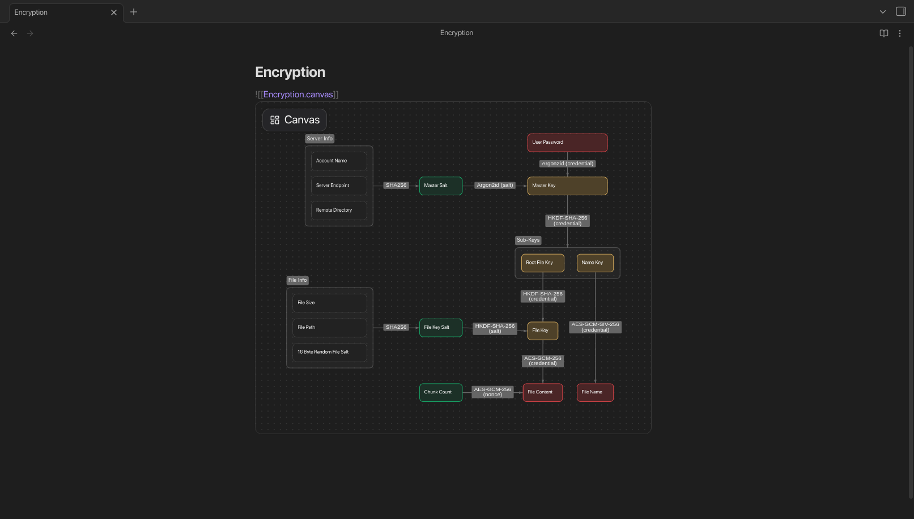
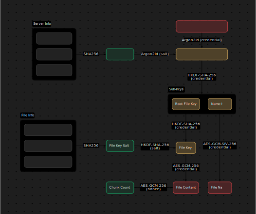

# Obsidian Canvas Lens

This is a Obsidian plugin that does two things:

- Export canvases to SVG, Obsidian only offers PNG export
- Replace static canvas-in-notes preview with interactive viewer, see [this forum post](https://forum.obsidian.md/t/show-a-complete-preview-of-the-canvas-including-text-when-a-canvas-is-embedded-in-a-note)

## Gallery

☝ Canvas embedded in a note

☝ Rendered canvas SVG (not `<foreignObject>`)

## Known Issues

- Interactive viewer canvas viewport shifts when Obsidian tab shifts (fixable)
- Cannot replace canvas in canvas pop-up previews
- Cannot render italic text (fixable)
- Text size and styling has a little difference from Obsidian's default (fixable)

## Development Roadmap

- Fix issues
- Add rounded corner, aspect ratio and light / dark mode options for users when exporting SVG.

**Not in roadmap**:

- modify Obsidian vanilla canvas rendering

## License

MIT License | Copyright ©️ 2026 Hesprs (Hēsperus)
